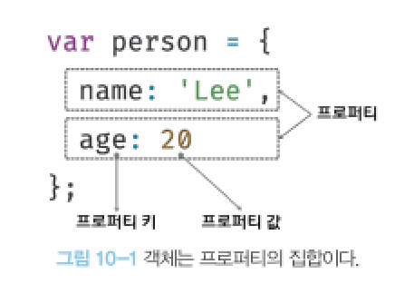
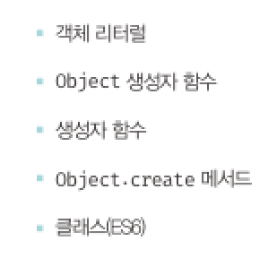
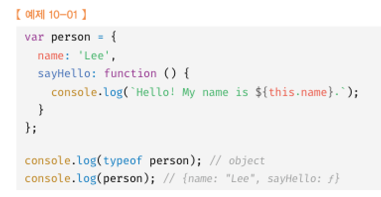
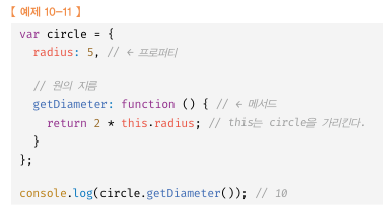
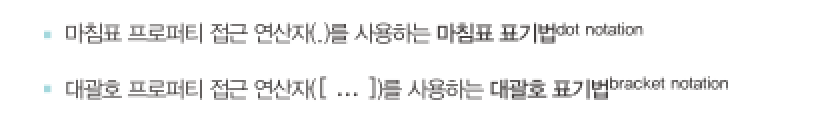
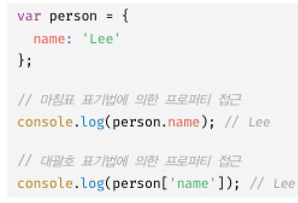
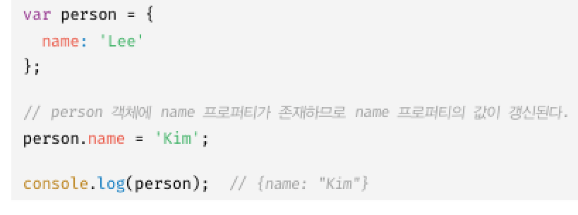
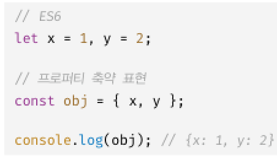
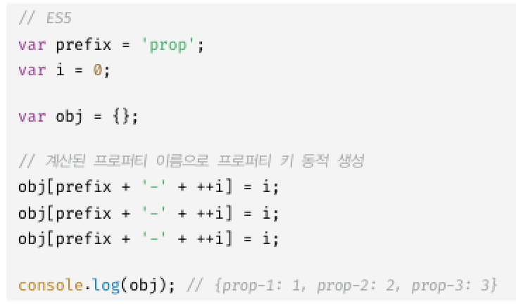
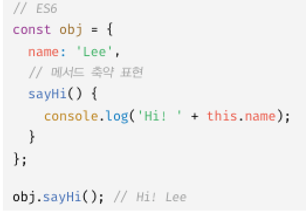

# 10장 객체리터럴  
## 10.1 객체란?   
객체는 0개 이상의 프로퍼티로 구성된 집합이며, 프로퍼티는 키와 값으로 구성됨



프로퍼티 : 객체의 상태를 나타내는 값  
매서드 : 프토퍼티를 참조하고 조작할 수 있는 동작  

## 10.2 객체 리터럴에 의한 객체 생성  
객체생성 방식  

  

객체리터럴 생성방식  
중괄호 내에 0개 이상의 프로퍼티를 정의함

## 10.3 프로퍼티  
객체는 프로퍼티의 집합이며 프로퍼티는 키와 값으로 구성됨  
  
  

식별자 규칙을 잘 따라서 프로퍼티 키를 지정해야함  

## 10.4 메서드  
프로퍼티 값으로 함수를 사용가능  

  

## 10.5 프로퍼티 접근





## 10.6 프로퍼티 값 갱신  



## 10.7 프로퍼티 동적 생성  
`
person.age = 10;
`

## 10.8 프로퍼티 삭제  
`
delete person.age
`

## 10.9 ES6에서 추가된 객체 리터럴의 확장기능  
### 10.9.1 프로퍼티 축양표현  



### 10.9.2 계산된 프로퍼티 이름  
대괄호 표기법을 이용해 표기  



### 10.9.3 메서드 축약 표현  



function키를 생략한 축약표현  


퀴즈
```
const student = {
  name: 'Alice',
  age: 20,
  greet() {
    console.log(`Hello, my name is ${this.name} and I am ${this.age} years old.`);
  }
};
```
'name' 프로퍼티의 값을 출력하세요.
'age' 프로퍼티의 값을 21로 변경하세요.
'greet' 메서드를 호출하세요.