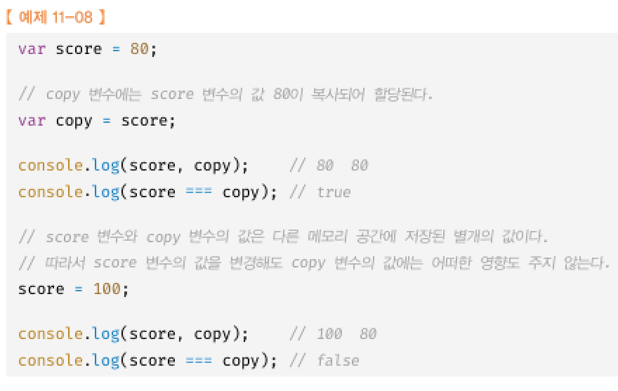
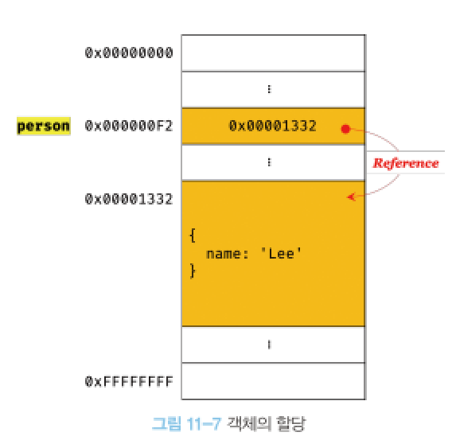
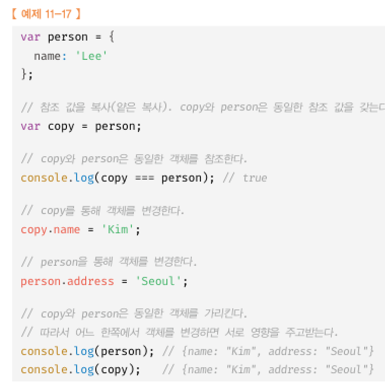

# 11장 원시값과 객체의 비교  
데이터 타입에는 원시 타입과 객체타입으로 구분됨  
 
원시값은 변경 불가능한 값 객체는 변경가능  
원시값을 변수에 할당하면 변수에는 실제 값이 저장됨, 객체는 참조값  
원시값을 다른 변수에 할당하면 값이 복사되어 전달됨 객체는 참조값이 복사되어 전달됨

## 11.1 원시값
### 11.1.1 변경 불가능한 값
원시값은 값은 변경 불가능한 값  
변수에 원시값을 재 할당하면 새로운 공간을 확보하고 값을 저장한 후에 변수가 참조하던 메모리 공간의 주소를 변경함  

### 11.1.2 문자열과 불변성


한번 생성된 문자열은 읽기 전용값으로 변경 불가능하다.
재할당은 가능함

### 11.1.3 값에 의한 전달



두 변수의 원시값은 서로 다른 메모리 공간에 저장된 별개의 값이 되어 어느 한쪽에서 재할당을 통해 값을 변경하더라도 서로 간섭 할 수 없다.

## 11.2 객체
### 11.2.1 변경 가능한 값
객체 타입의 값은 변경 가능한 값이다.
객체값은 참조값을 저장하고 있다.



원시값은 값을 변경하려면 재할당을 하지만
객체값은 직접 변경할 수 있다.
여러개의 식별자가 하나의 객체를 공유할 수도 있다.

### 11.2.2 참조에 의한 전달
두개의 식별자가 하나의 객체를 공유한다
따라서 원본이나 사본 중 어느하나의 값을 변경하면 서로 영향을 주고 받는다

 


퀴즈
```
const person1 = { name: 'John', age: 30 };
const person2 = person1;

person2.name = 'Jane';

console.log(person1.name); // ?
console.log(person2.name); // ?
```

person1.name의 출력 결과는 무엇인가요?  
person2.name의 출력 결과는 무엇인가요?  
왜 person1.name이 'Jane'으로 변경되었는지 설명해주세요.  

