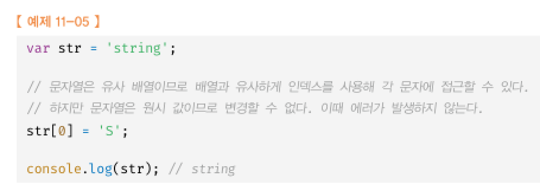

11장 원시값과 객체의 비교
데이터 타입에는 원시 타입과 객체타입으로 구분됨

원시값은 변경 불가능한 값 객체는 변경가능
원시값을 변수에 할당하면 변수에는 실제 값이 저장됨, 객체는 참조값
원시값을 다른 변수에 할당하면 값이 복사되어 전달됨 객체는 참조값이 복사되어 전달됨

11.1 원시값
11.1.1 변경 불가능한 값
원시값은 값은 변경 불가능한 값
변수에 원시값을 재 할당하면 새로운 공간을 확보하고 값을 저장한 후에 변수가 참조하던 메모리 공간의 주소를 변경함

11.1.2 문자열과 불변성

