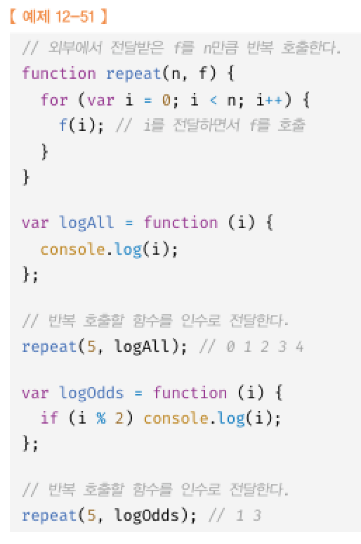

# 12장 함수

## 12.1 함수란?

함수는 일련의 과정을 문으로 구현하고 코드블록으로 감싸서 하나의 실행단위로 정의한 것이다.  

  
 
함수 내부로 전달받는 변수를 매개변수, 입력을 인수, 출력을 반환값 이라고 한다.  

## 12.2 함수를 사용하는 이유  

 코드의 재사용이라는 측면에서 사용, 유지보수의 편의성, 코드의 신뢰성  
 적절한 함수이름은 코드의 가독성을 향상시킨다.  

## 12.3 함수리터럴  
 자바스크립트의 함수는 객체다.  
 함수리터럴로 함수를 생성하려면?  

## 12.4 함수정의  
함수 정의방법 4가지  

### 12.4.1 함수선언문     

  

함수 선언문은 함수 이름을 생략할 수 없다.    
함수 선언문은 표현식이 아닌 문임    
자바스크립트 엔진은 생성된 함수를 호출하기 위해 함수 이름과 동일한 이름의 식별자를 암묵적으로 생성하고 거기에 함수 객체를 할당한다.    

  

함수는 함수 이름으로 호출하는 것이 아니라 함수 객체를 가리키는 식별자로 호출한다  

### 12.4.2 함수 표현식  
자바스크립트의 함수는 일급객체다 => 함수를 값처럼 자유롭게 사용가능(변수에 할당가능)  

함수 표현식에서 함수 리터럴은 생략하는게 일반적임

### 12.4.3 함수 생성 시점과 함수 호이스팅
함수 선언문으로 정의한 함수와 함수 표현식으로 정의한 함수의 생성시점은 다르다.  
함수 선언문이 코드의 선두로 끌어 올려진 것처럼 동작하는것을 함수 호이스팅 이라고 한다.  
함수 선언문은 변수 할당과 초기화가 동시에 되므로 정의하기 전에 호출가능  
함수 표현식은 변수 호이스팅으로인해 타입에러 발생  

12.4.4 Function 생성자 함수

일반적이지 않고 잘 사용안함

### 12.4.5 화살표함수  
ES6 문법

## 12.5 함수호출
### 12.5.1 매개변수와 인수

매개변수는 함수를 정의할떄 선언하며 변수와 동일하게 취급된다.  
함수가 호출되면 함수내에서 매개변수가 생성되고 undefined로 초기화된 후 인수가 순서대로 할당된다  
할당되지 않은 인수는 undefined  
매개변수보다 인수가 더 많은 경우 무시됨  

### 12.5.2 인수 확인
js함수는 매개변수와 인수의 갯수가 일치하는지 확인하지 않음, 매개변수의 타입을 체크하지 않음  
typeof로 체그하거나 argument객체를 통해 체크 가능  

ES6에서 도입된 매개변수 기본값  

### 12.5.3 매개변수의 최대 개수
3개 이상을 넘지 않는게 좋고, 그 이상이 필요하다면 객체로 전달하는게 좋음  

### 12.5.4 반환문
return키워드 뒤에 반환값이 없거나 생략할경우 undefined를 반환함  

## 12.6 참조에 의한 전달과 외부 상태의 변경
원시값은 값에 의한 전달 객체는 참조에 의한 전달  

## 12.7 다양한 함수의 형태
### 12.7.1 즉시실행 함수

그룹 연산자로 함수를 묶어 함수 리터럴을 평가해 함수 객체를 생성함
맨뒤에()는 실행하는 부분  

### 12.7.2 재귀 함수  
함수가 자기 자신을 호출하는 것을 재귀 호출이라고 함  

탈출조건문을 작성해야함

### 12.7.3 중첩함수
함수 내부에 정의된 함수를 중첩함수 또는 내부함수라고함  

ES6부터 함수 정의는 문이 위치할 수 있는 문맥이라면 어디든지 가능

### 12.7.4 콜백 함수
함수의 매개변수를 통해 다른 함수의 내부로 전달되는 함수를 콜백함수  
매개변수를 통해 함수의 외부에서 콜백함수를 전달받은 함수를 고차함수라고함  

### 12.7.5 순수함수와 비순수함수
외부 상태에 의존하지 않고 변경하지도 않는 함수를 순수함수라고 함  
그 반대는 비순수 함수  

