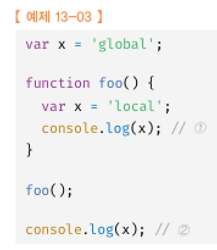
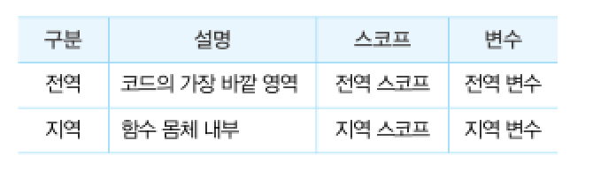
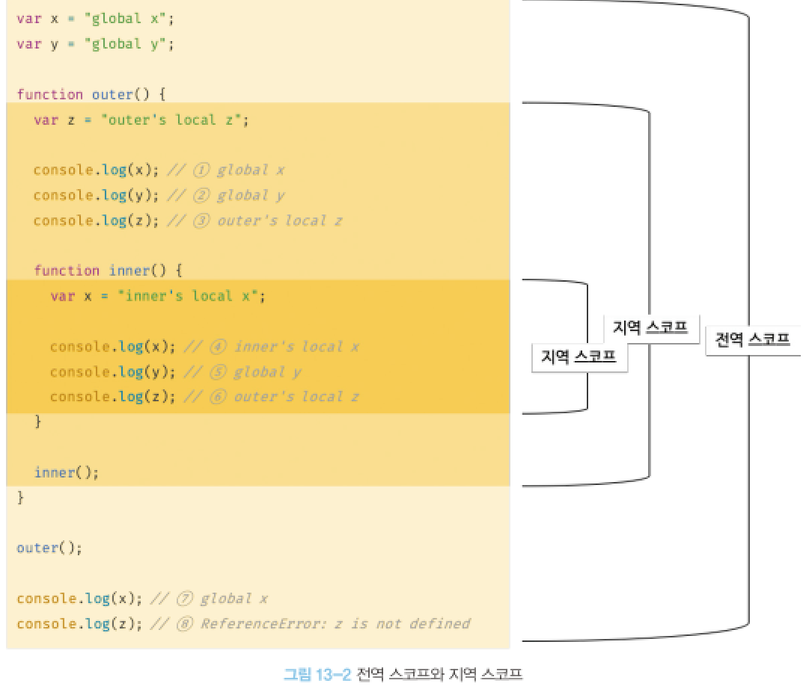
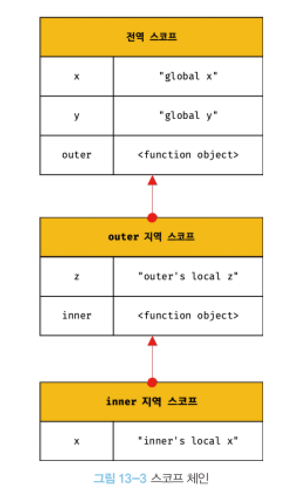
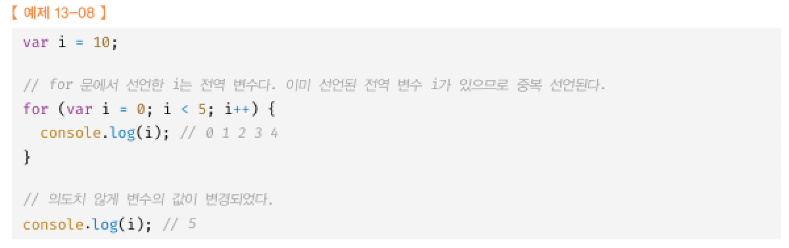
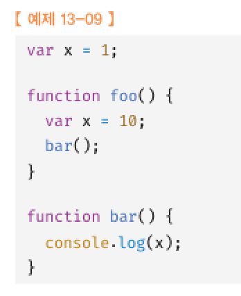

# 13장 스코프
## 13.1 스코프란?
 
모든 식별자는 자신이 선언된 위치에 의해 다른 코드가 식별자 자신을 참조할 수 있는 유효범위가 결정된다.  
스코프란 자바스크립트 엔진이 식별자를 검색할 때 사용하는 규칙이다.  

 
## 13.2 스코프의 종류

전역 변수는 어디든지 참조 할 수 있다.

### 13.2.2 지역과 지역 스코프
지역이란 함수 몸체 내부  
지역변수는 자신의 지역 스코프와 하위 지역 스코프에서 유효함  

## 13.3 스코프 체인
스코프가 함수의 중첩에 의해 계층적 구조를 가짐  
변수를 참조할 떄 자바스크립트 엔진은 스코프 체인을 통해 변수를 참조하는 코드의 스코프에서 시작하여 상위 스코프 방향으로 이동하며 선언된 변수를 검색한다.  
상위 스코프에서 유효한 변수는 하위 스코프에서 자유롭게 참조할 수 있지만 하위 스코프에서 유효한 변수를 상위 스코프에서는 참조할 수 없다.  

### 13.3.4 함수레벨 스코프

함수에 의해서만 지역 스코프가 생성된다. (블록레벨 스코프를 지원하는 다른언어랑 다름)

let const로 선언된 변수는 블록레벨 스코프를 지원함

### 13.3.5 렉시컬 스코프

상위 스코프가 동적으로 변하지 않고 함수 정의가 평가되는 시점에 상위 스코프가 결정됨  
