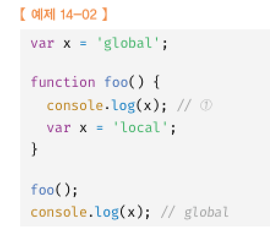

# 14. 전역 변수의 문제점
## 14.1 변수의 생명주기
### 14.1.1 지역 변수의 생명주기
 
지역변수의 생명주기는 함수의 생명주기와 일치함  

호이스팅은 스코프를 단위로 동작함  

### 14.1.2 전역변수의 생명주기
var 키워드로 선언한 전역 변수의 생명주기는 전역 객체의 생명주기와 일치함  

## 14.2 전역 변수의 문제점
모든 코드가 전역 변수를 참조하고 변경할 수 있다  
생명주기가 길다.  
스코프 체인 상 종점에 존재하기 떄문에 검색속도가 느리다  

## 14.3 전역 변수의 사용을 억제하는 방법
변수의 스코프는 좁을수록좋다.-> 지역변수 사용  

모든 코드를 즉시실행 함수로 감싸면 모든 변수는 즉시실행 함수의 지역 변수가 된다.  

모듈 패턴을 사용하자  

ES6모듈을 사용하자   
ES6 모듈은 파일 자체의 독자적인 모듈 스코프를 제공한다.  

webpack의 모듈 번들러를 사용하자  