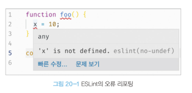
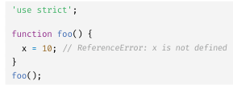
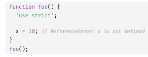
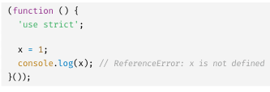
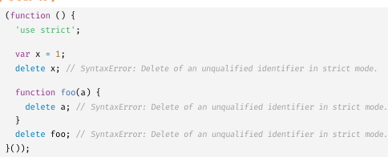
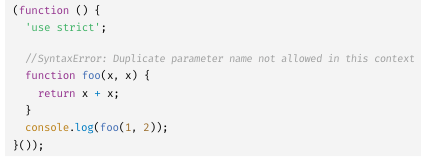
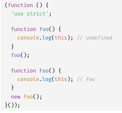
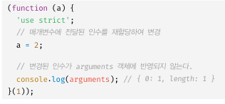

# 20 strict mode  

## 20.1 strict mode란?  
ES5에서 strict mode가 추가됨  
자바스크립트 언어의 문법을 엄격하게 적용하여 오류를 발생시킬 가능성이 높거나 최적화에 문제를 일으킬 수 있는 코드에 명시적인 에러를 발생시킴  
ESLint : 정적 분석 기능을 통해 문법적 오류 뿐만 아니라 정적 오류까지 찾아내고 오류의 원인을 리포팅 해주는 도구  


## 20.2 strict mode의 적용  
전역 제일 위에 추가  


함수 몸체 제일 위에 추가  


## 20.3 전역에 strict mode를 적용하는 것은 피하자  
```
<script>
    'use strict'
    var a = 10;
    ...
</script>
<script>
    'use strict'
    console.log('hello');
    ...
</script>
```
스크립트 단위로 use strict가 적용되기 떄문에 피하자

## 20.4 함수 단위로 strict mode를 적용하는 것도 피하자
```
<script>
function a(){
    'use strict'
    ...
    let a = 20;
}

function b(){
    'use strict'
    ...
    let b = 30;
}
</script>
```
어떤 함수에는 strict모드고 어떤함수에는 적용하지 않는것은 바람직하지 않으며 일일히 모든 함수에 적용시키는 것은 번거로운 일이다.  

## 20.5 strict mode가 발생시키는 에러
strict 모드가 적용되었을때 발생하는 에러에 대해 알아보자

### 20.5.1 암묵적 전역
  
선언하지 않은 변수를 참조하는것

### 20.5.2 변수 함수 매개변수의 삭제
  
delete 연산자로 변수 함수 매개변수를 삭제하면 syntaxError가 발생함

### 20.5.3 매개변수 이름의 중복
  
중복된 매개변수 이름을 사용시 SyntaxError가 발생함

### 20.5.4 with문의 사용
with문은 사용하지 않는것이 좋다. 사용시 문법 에러 발생

## 20.6 strict mode 적용에 의한 변화

### 20.6.1 일반 함수의 this
  
strict 모드에서 함수를 일반 함수로 호출시 this에 undefined가 바인딩 됨

### 20.6.2 arguments 객체
  
매개변수에 전달된 인수를 재할당하여 변경해도 바뀌지 않음

#퀴즈
const obj = {
    a : 10,
};

function testParamChange(param){
    'use strict'
    param.a = 20;
} 

testParamChange(obj);
console.log(obj.a);  //?