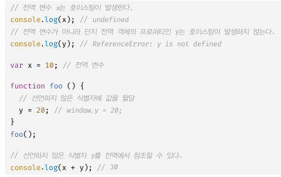

# 21 빌트인 객체  

## 21.1 자바스크립트 객체의 분류
자바스크립트의 객체는 크게 3개로 나눌 수 있다.  
표준빌트인 객체, 호스트객체, 사용자 정의 객체

## 21.2 표준 빌트인 객체
Object, String, Number, Boolean Symbol, Date, Math, RegExp, Array, Map, Set WeakMap, WeakSet, Function, Promise, Reflect, Proxy, JSON, Error 등등 40 여개의 표준 빌트인 객체를 제공함  
빌트인 객체는 프로토타입 메서드와 정적 메서드를 제공하고 생성자 함수 객체가 아닌 표준 빌트인 객체는 정적 메서드만 제공함


## 21.3 원시값과 래퍼 객체
문자열이나 숫자 불리언 등의 원시값이 있는데도 String, Number, Boolean등의 표준 빌트인 생성자 함수가 존재하는 이유는?  
> 내부적으로 원시값에 대해 객체처럼 마침표로 접근하면 자바스크립트 엔진이 연관된 객체로 변환해줌(래퍼객체)  
>원시값 string도 String.prototype 메서드를 사용할 수 있는 이유임


## 21.4 전역 객체  
전역객체는 javascript 환경에 따라 
>브라우저 환경 : window  
>node.js환경 : global  

전역객체의 프로퍼티를 참조할때 window(global)을 생략 할 수 있음   

전역 객체는 Object String Boolean Funtion, Array같은 표준 빌트인 객체를 프로퍼티로 가지고 있음  

var키워드로 선언한 전역 변수와 선언하지 않은 변수에 값을 할당한 암묵적 전역, 그리고 전역 함수는 전역 객체의 프로퍼티가 된다  


브라우저 환경의 모든 javascript 코드는 하나의 전역 객체 window를 공유한다.

### 21.4.1 빌트인 전역 프로퍼티

Infinity : 무한대를 나타내는 숫자값  
NaN : 숫자가 아님  
undefined : undefined

### 21.4.2 빌트인 전역 함수
Eval : 문자열을 전달받아 표현식이라면 런타임에 값을 생성하고 표현식이 아닌 문이면 문자열 코드를 런타임에 실햄함. 여러개의 문이면 모든문을 실행하고 마지막 결과값을 반환함  
보안에 취약하므로 사용하지 않는 것을 추천함  

isFInite : 유한수인지 체크  
isNaN : 숫자인지 체크  
parseFloat : 문자열 인수를 부동 소수점 숫자(실수) 로 변환함  
parseInt : 전달받은 문자열 인수를 정수로 번환함

encodeURI : 문자열을 이스케이프 처리를 위해 인코딩함  
decodeURI : 인코딩된 문자열을 디코딩함  
encodeURIComponent : URI 구성요소를 부분적으로 인코딩  
decodeURIComponent : URI 구성요소를 부분적으로 디코딩  

encodeURIComponent의 경우 = ? & 까지 인코딩함

### 21.4.3 암묵적 전역

변수 선언 식별자를 쓰지않으면 암묵적 전역이 일어남  
변수가 아니고 window 프로퍼티로 추가됨 -> 변수 
호이스팅이 일어나지 않음  


delete로 삭제 가능함


#퀴즈
```
let str = "Hello, world!";
let length = str.length;
let upperStr = str.toUpperCase();
```
str 변수는 어떻게 length 프로퍼티와 toUpperCase() 메서드에 접근할 수 있는지 설명하고, 이것이 표준 빌트인 객체와 어떻게 관련되어 있는지 설명하세요.