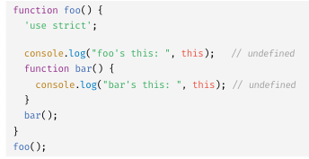
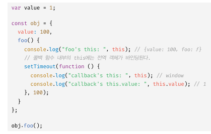

# 22 this
자신이 속한 객체를 가리키는 식별자를 참조할 수 있어야 한다  

## 22.1 this 키워드
this는 자신이 속한 객체 또는 자신이 생성할 인스턴스를 가리키는 자기참조변수다. this를 통해 자신이 속한 객체 또는 자신이 생성할 인스턴스의 프로퍼티나 메서드를 참조할 수 있다.  
this바인딩은 함수 호출 방식에 의해 동적으로 결정된다.  

  
객체 리터럴 의 메서드 내부에서의 this는 메서드를 호출한 객체 circle이다.  

   
생성자 함수 내부의 this는 생성자 함수가 생성할 인스턴스를 가리킨다.  
javascript의 this는 함수가 호출되는 방식에 따라 this에 바인딩 될 값이 동적으로  결정된다

## 22.2 함수 호출 방식과this 바인딩
this 바인딩은 함수 호출 방식, 즉 함수가 어떻게 호출되었는지에 따라 동적으로 결정된다

### 22.2.1 일반 함수 호출

전역 함수는 물론이고 중첩함수를 일반 함수로 호출시 this에는 전역 객체가 바인딩 된다  
  
strict 모드시 this에는 undefined가 반환됨  
  
콜백함수도 마찬가지로 this에 전역객체가 바인딩됨  
  
화살표 함수의 경우 내부의 this는 상위 스코프의 this를 가리킴

### 22.2.2 메서드 호출
메서드 내부의 this에는 메서드를 호출한 객체, 즉 메서드를 호출할 떄 메서드 이름 앞의 마침표 연산자 앞에 기술한 객체가 바인딩 됨  
  

### 22.2.3 생성자 함수 호출  
생성자 함수 내부의 this에는 생성자 함수가 생성할 인스턴스가 바인딩 됨  
  

### 22.2.4 Function.prototype.apply/call/bind 메서드에 의한 간접 호출  
  
call, apply : 함수를 호출할떄 this에 바인딩 할 객체를 지정함  
  
bind : 첫번째 인수로 전달한 값으로 this바인딩이 교체된 함수를 새롭게 생성해 반환함  

정리

